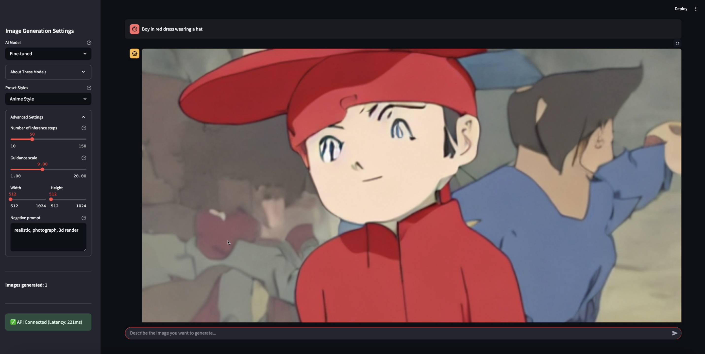
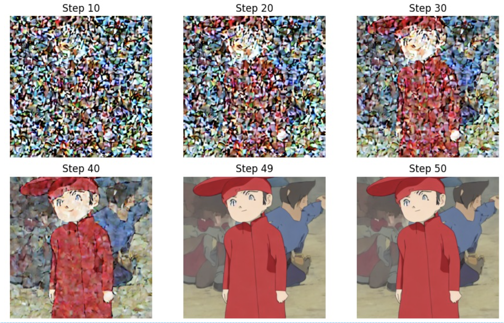
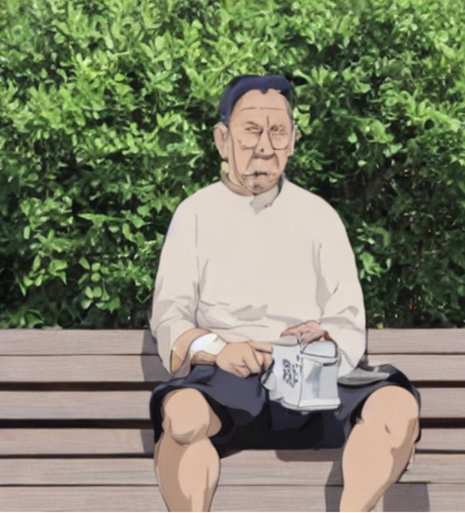

# 🧠 Prompt-to-Picture: Fine-Tuned Text-to-Image Generation with LoRA + Stable Diffusion

This project implements a custom **text-to-image generation pipeline** using a fine-tuned [Stable Diffusion v1.5](https://huggingface.co/runwayml/stable-diffusion-v1-5) model. It’s optimized using **LoRA (Low-Rank Adaptation)** for fast, lightweight domain-specific tuning — in this case, for generating **anime-style images** like *Naruto eating ramen* 🍜.

---

## 🚀 Project Overview

We fine-tuned the **U-Net** component of Stable Diffusion using LoRA adapters trained on a curated Naruto dataset. The result is a **tiny 5MB LoRA adapter** that drastically improves generation quality for Naruto-style prompts.

- 🔧 **LoRA-tuned U-Net** (5MB)
- ⚡ **FastAPI backend** for image generation
- 🖼️ **Streamlit frontend** with prompt + slider
- 📈 **CLIPScore evaluation** for semantic accuracy

---

## 🖼️ Streamlit UI

<div align="center">
  
</div>

---

## 🔬 How It Works

1. The user enters a text prompt.
2. The prompt is tokenized using CLIP.
3. A latent image is initialized with noise.
4. The **U-Net (LoRA fine-tuned)** removes noise over 50 steps.
5. The VAE decoder reconstructs the final image.

### ⛅ Denoising Visualization:

<div align="center">
  
</div>

---

## 🧪 Example Outputs

| Prompt                     | LoRA Model Output                      |
|---------------------------|----------------------------------------|
| `Animated Bill Gates`     |  |
| `Man sitting on a bench`  |  |

---

## 🔧 Tech Stack

- `diffusers` + `peft` for model training
- `FastAPI` to serve inference endpoints
- `Streamlit` for a live interactive UI
- `CLIP` for semantic evaluation (CLIPScore)

---

## ⚙️ How to Run

### 🔁 Inference API
```bash
uvicorn app:app --host 0.0.0.0 --port 8000

```bash
streamlit run app.py
